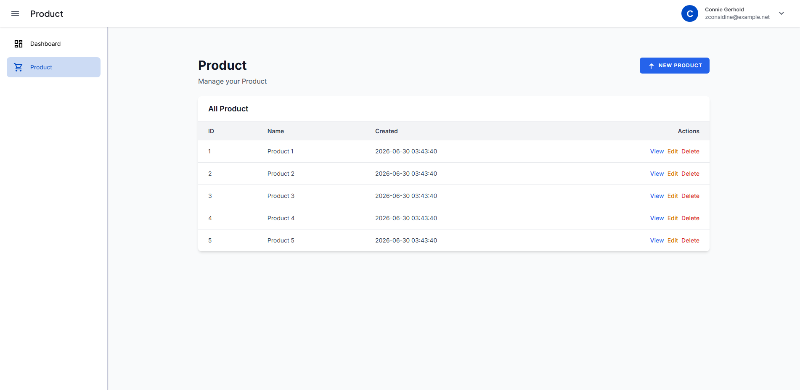

# CRUD Generator — Generated Output Showcase

This document shows what `make:rsc` generates out of the box, using `Product` as the example model.

> `make:rsc` generates a **Livewire-based** CRUD (components under `app/Livewire`, no Controller or `Route::resource`). Screenshots below may still reflect an earlier Controller+Blade layout; the current file list, routes, and architecture diagram have been updated to match the Livewire generator.

---

## Command Used

```bash
php artisan make:rsc Product --label="Products"
```

---

## What Gets Generated

Running the command produces a complete, working module in seconds:

| File | Purpose |
|---|---|
| `app/Models/Product.php` | Eloquent model |
| `app/Repositories/Product/ProductRepositoryInterface.php` | Repository contract |
| `app/Repositories/Product/ProductRepository.php` | Repository implementation |
| `app/Services/ProductService.php` | Business logic layer |
| `app/Livewire/Products/ProductIndex.php` | Index component (listing, filters, sort, delete) |
| `app/Livewire/Products/ProductCreate.php` | Create component |
| `app/Livewire/Products/ProductEdit.php` | Edit component |
| `app/Http/Requests/Product/StoreProductRequest.php` | Create validation |
| `app/Http/Requests/Product/UpdateProductRequest.php` | Update validation |
| `resources/views/livewire/products/product-index.blade.php` | List view via `<x-livewire-data-table>` |
| `resources/views/livewire/products/product-create.blade.php` | Create form |
| `resources/views/livewire/products/product-edit.blade.php` | Edit form |
| `database/migrations/xxxx_add_products_permissions_and_assign_to_admin.php` | CRUD permission migration, synced to `admin` role |
| `routes/web.php` (modified) | `Route::get` entries for index/create/edit + component imports |
| `app/Providers/AppServiceProvider.php` (modified) | Repository binding |
| `config/sidebar.php` (modified) | Sidebar menu entry |

There is no generated `show` view/route and no Controller — the Index component handles delete inline via a browser event (`open-delete-confirm`), and Create/Edit submit through Livewire actions rather than `POST`/`PUT` routes.

---

## Generated Views — Screenshots

All screenshots below are captured from an actual generated module running in the app.

### 1. Index — `/products`

The list page renders through the shared `<x-livewire-data-table>` component with Livewire-driven search, sort, and pagination. The sidebar automatically shows the active "Products" item with its icon.



**Key features:**
- Header with title and "**+ NEW PRODUCTS**" button
- Column-aware filter UI (text, date range, enum dropdown) with Apply / Reset buttons
- Server-rendered table with `wire:click` sorting — no AJAX/DataTables.js involved
- Columns and filter inputs derived automatically from column definitions at generation time
- Edit / Delete action buttons per row; Delete opens the single global confirm modal (`resources/views/layouts/app.blade.php`)
- Empty-state "No records yet." when table has no records

---

### 2. Create — `/products/create`

The create form is auto-generated from the column configuration provided during `make:rsc`. Columns with `text`, `email`, `number`, `textarea`, `select`, `radio`, and `date` types all generate the appropriate HTML input.


**Key features:**
- Breadcrumb: `Products / Create`
- "Fill in the form below to create a new record" subtitle
- Form fields generated per column type
- `CREATE` (primary) and `CANCEL` (secondary) buttons
- Inline validation error display on submit failure

---

### 3. Edit — `/products/{id}/edit`

The edit form mirrors the create form but pre-fills fields with existing record data and shows a "Save Changes" button instead.


**Key features:**
- Breadcrumb: `Products / {id} / Edit`
- "Update the record details" subtitle
- Pre-filled form fields (when columns have data)
- `SAVE CHANGES` (primary) and `CANCEL` (secondary) buttons

---

## Architecture of Generated Code

```
Livewire Component (ProductIndex / ProductCreate / ProductEdit)
    │
    ▼
ProductService             ← Business logic (create, update, find, delete)
    │
    ▼
ProductRepositoryInterface ← Contract (bound in AppServiceProvider)
    │
    ▼
ProductRepository          ← Eloquent queries
    │
    ▼
products table              ← Database
```

**Validation** is handled by `StoreProductRequest` and `UpdateProductRequest`, invoked from within the Livewire component.

---

## Routes Generated

```
GET   /products              → ProductIndex   (list + delete)
GET   /products/create       → ProductCreate  (create form + submit)
GET   /products/{product}/edit → ProductEdit  (edit form + submit)
```

Create/Edit forms submit via Livewire actions on the same route rather than separate `POST`/`PUT` endpoints, and there is no `show`/`destroy` route — delete happens through the `delete-confirmed` Livewire event dispatched by the global modal.

---

## Sidebar Integration

The generator appends an entry to `config/sidebar.php`. The sidebar blade component renders all entries from this config, so no HTML is injected directly:

```php
// config/sidebar.php
[
    'label'          => 'Products',
    'route'          => 'products.index',
    'icon'           => 'shopping_cart',
    'active_pattern' => 'products.*',
],
```

Active state is applied automatically when any `products.*` route is active.

---

## Permission Integration

The generator also creates a permission migration that registers `products.view`, `products.create`, `products.update`, and `products.delete`, then syncs them to the `admin` role:

```php
// database/migrations/xxxx_add_products_permissions_and_assign_to_admin.php
private array $permissions = [
    'products.view'   => ['label' => 'View Products', 'group' => 'Products'],
    'products.create' => ['label' => 'Create Products', 'group' => 'Products'],
    'products.update' => ['label' => 'Update Products', 'group' => 'Products'],
    'products.delete' => ['label' => 'Delete Products', 'group' => 'Products'],
];
```

The migration is run immediately (prompted, defaults to yes) alongside the table migration, so the `admin` role can access the new module right away.

---

## Regenerating Screenshots

To recapture these screenshots after making changes, run:

```bash
php artisan dusk tests/Browser/CaptureProductCrudScreenshotsTest.php
```

Screenshots are saved to `docs/dusk/images/crud/`.

---

## Deleting a Generated Module

```bash
php artisan delete:rsc Product
```

This removes all generated files and undoes the route, service provider, and sidebar modifications. Pass `--migrations` to also delete the migration file.
